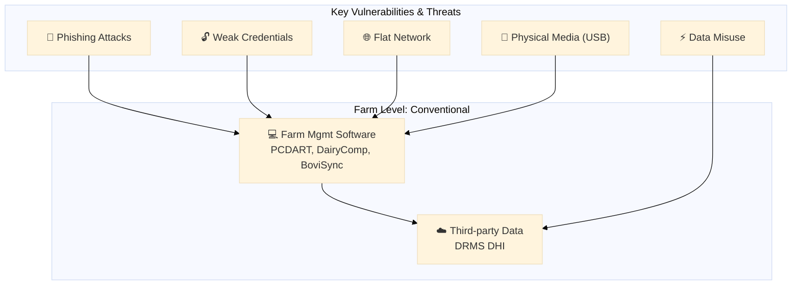

```mermaid
%%{init: {'theme': 'base', 'fontSize': 12}}%%
graph TD
    subgraph "Farm Level: Conventional"
        FM["💻 Farm Mgmt Software<br/>PCDART, DairyComp, BoviSync"]
        TP["☁️ Third-party Data<br/>DRMS DHI"]
    end
    subgraph "Key Vulnerabilities & Threats"
        P["🎣 Phishing Attacks"]
        W["🔓 Weak Credentials"]
        F["🌐 Flat Network"]
        U["💾 Physical Media (USB)"]
        D["⚡ Data Misuse"]
    end
    FM --> TP
    P --> FM
    W --> FM
    F --> FM
    U --> FM
    D --> TP
```    