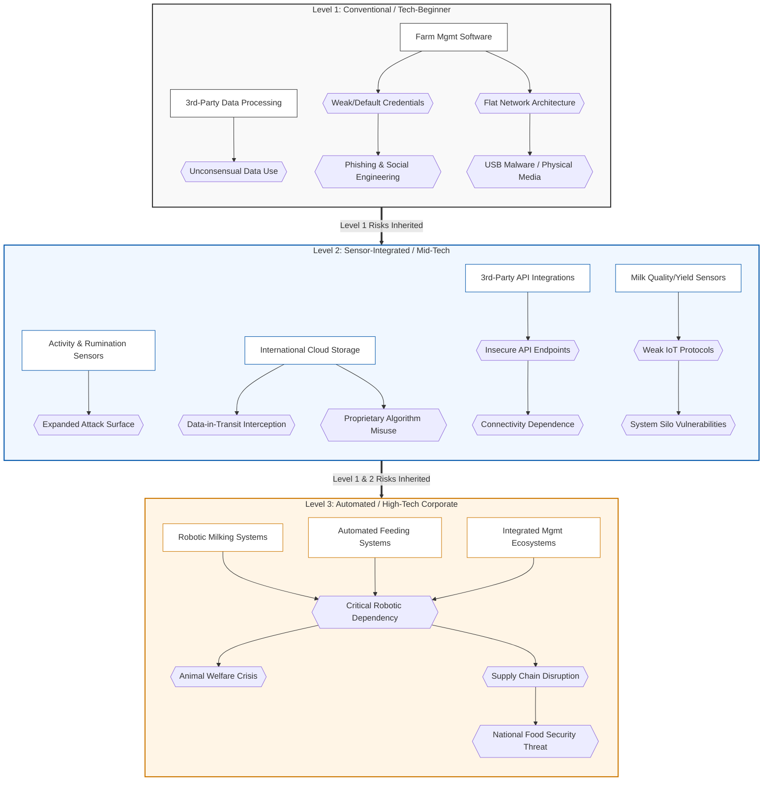

```mermaid

graph TB
    %% --- LEVEL 1: CONVENTIONAL ---
    subgraph L1 [Level 1: Conventional / Tech-Beginner]
        direction TB
        T1_1[Farm Mgmt Software]
        T1_2[3rd-Party Data Processing]
        
        V1_1{{Phishing & Social Engineering}}
        V1_2{{Weak/Default Credentials}}
        V1_3{{Flat Network Architecture}}
        V1_4{{USB Malware / Physical Media}}
        V1_5{{Unconsensual Data Use}}

        T1_1 --> V1_2
        T1_1 --> V1_3
        T1_2 --> V1_5
        V1_2 --> V1_1
        V1_3 --> V1_4
    end

    %% --- LEVEL 2: SENSOR-INTEGRATED ---
    subgraph L2 [Level 2: Sensor-Integrated / Mid-Tech]
        direction TB
        T2_1[Activity & Rumination Sensors]
        T2_2[Milk Quality/Yield Sensors]
        T2_3[3rd-Party API Integrations]
        T2_4[International Cloud Storage]

        V2_1{{Expanded Attack Surface}}
        V2_2{{Weak IoT Protocols}}
        V2_3{{Insecure API Endpoints}}
        V2_4{{Data-in-Transit Interception}}
        V2_5{{Proprietary Algorithm Misuse}}
        V2_6{{Connectivity Dependence}}
        V2_7{{System Silo Vulnerabilities}}

        T2_1 --> V2_1
        T2_2 --> V2_2
        T2_3 --> V2_3
        T2_4 --> V2_4
        T2_4 --> V2_5
        V2_3 --> V2_6
        V2_2 --> V2_7
    end

    %% --- LEVEL 3: AUTOMATED ---
    subgraph L3 [Level 3: Automated / High-Tech Corporate]
        direction TB
        T3_1[Robotic Milking Systems]
        T3_2[Automated Feeding Systems]
        T3_3[Integrated Mgmt Ecosystems]

        V3_1{{Critical Robotic Dependency}}
        V3_2{{Animal Welfare Crisis}}
        V3_3{{Supply Chain Disruption}}
        V3_4{{National Food Security Threat}}

        T3_1 --> V3_1
        T3_2 --> V3_1
        T3_3 --> V3_1
        V3_1 --> V3_2
        V3_1 --> V3_3
        V3_3 --> V3_4
    end

    %% --- CUMULATIVE CONNECTORS ---
    L1 ==>|Level 1 Risks Inherited| L2
    L2 ==>|Level 1 & 2 Risks Inherited| L3

    %% --- STYLING ---
    style L1 fill:#f9f9f9,stroke:#333,stroke-width:2px
    style L2 fill:#f0f7ff,stroke:#0055aa,stroke-width:2px
    style L3 fill:#fff5e6,stroke:#cc7700,stroke-width:2px
    
    %% Tech Styles (Rectangles)
    style T1_1 fill:#fff,stroke:#333
    style T1_2 fill:#fff,stroke:#333
    style T2_1 fill:#fff,stroke:#0055aa
    style T2_2 fill:#fff,stroke:#0055aa
    style T2_3 fill:#fff,stroke:#0055aa
    style T2_4 fill:#fff,stroke:#0055aa
    style T3_1 fill:#fff,stroke:#cc7700
    style T3_2 fill:#fff,stroke:#cc7700
    style T3_3 fill:#fff,stroke:#cc7700

    %% Threat Styles (Double Border/Hexagon Logic)
    %% Note: Mermaid uses double brackets {{ }} for hex shapes which look great in journals.
```