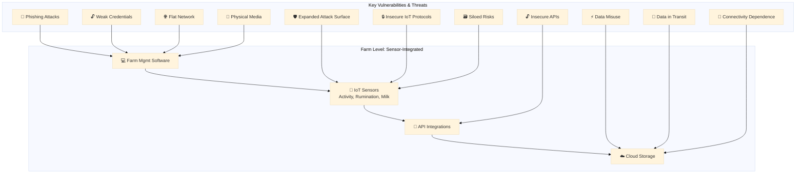

```mermaid
%%{init: {'theme': 'base', 'fontSize': 12}}%%
graph TD
    subgraph "Farm Level: Sensor-Integrated"
        FM2["💻 Farm Mgmt Software"]
        IOT["📡 IoT Sensors<br/>Activity, Rumination, Milk"]
        API["🔗 API Integrations"]
        CLD["☁️ Cloud Storage"]
    end
    subgraph "Key Vulnerabilities & Threats"
        P2["🎣 Phishing Attacks"]
        W2["🔓 Weak Credentials"]
        F2["🌐 Flat Network"]
        U2["💾 Physical Media"]
        D2["⚡ Data Misuse"]
        X["🛡️ Expanded Attack Surface"]
        I["🔒 Insecure IoT Protocols"]
        A["🔓 Insecure APIs"]
        T["🚚 Data in Transit"]
        S["🗃️ Siloed Risks"]
        C["📶 Connectivity Dependence"]
    end
    FM2 --> IOT
    IOT --> API
    API --> CLD
    P2 --> FM2
    W2 --> FM2
    F2 --> FM2
    U2 --> FM2
    D2 --> CLD
    X --> IOT
    I --> IOT
    A --> API
    T --> CLD
    S --> IOT
    C --> CLD
```