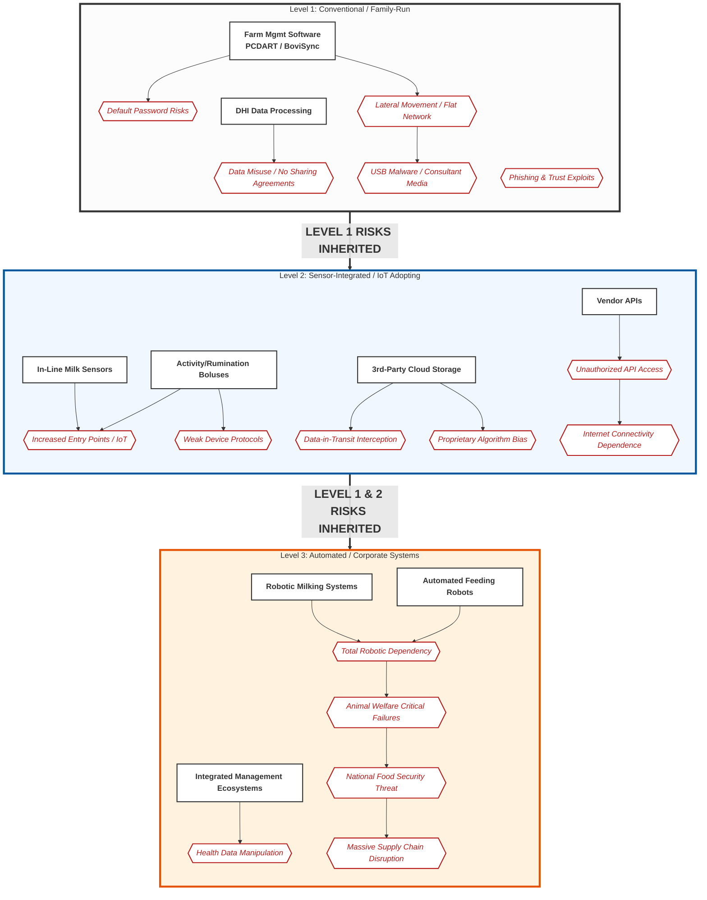

```mermaid
graph TB
    %% --- GLOBAL STYLING ---
    classDef tech fill:#ffffff,stroke:#333,stroke-width:2px,font-weight:bold;
    classDef threat fill:#ffffff,stroke:#b71c1c,stroke-width:2px,color:#b71c1c,font-style:italic;

    %% --- LEVEL 1: CONVENTIONAL ---
    subgraph L1 [Level 1: Conventional / Family-Run]
        direction TB
        T1A[Farm Mgmt Software<br/>PCDART / BoviSync]:::tech
        T1B[DHI Data Processing]:::tech
        
        V1A{{Phishing & Trust Exploits}}:::threat
        V1B{{Default Password Risks}}:::threat
        V1C{{Lateral Movement / Flat Network}}:::threat
        V1D{{USB Malware / Consultant Media}}:::threat
        V1E{{Data Misuse / No Sharing Agreements}}:::threat

        T1A --> V1B & V1C
        T1B --> V1E
        V1C --> V1D
    end

    %% --- CUMULATIVE TRANSITION 1 ---
    L1 ==>|<b><font size='5'>LEVEL 1 RISKS INHERITED</font></b>| L2

    %% --- LEVEL 2: SENSOR-INTEGRATED ---
    subgraph L2 [Level 2: Sensor-Integrated / IoT Adopting]
        direction TB
        T2A[Activity/Rumination Boluses]:::tech
        T2B[In-Line Milk Sensors]:::tech
        T2C[3rd-Party Cloud Storage]:::tech
        T2D[Vendor APIs]:::tech

        V2A{{Increased Entry Points / IoT}}:::threat
        V2B{{Weak Device Protocols}}:::threat
        V2C{{Unauthorized API Access}}:::threat
        V2D{{Data-in-Transit Interception}}:::threat
        V2E{{Proprietary Algorithm Bias}}:::threat
        V2F{{Internet Connectivity Dependence}}:::threat

        T2A & T2B --> V2A
        T2A --> V2B
        T2D --> V2C
        T2C --> V2D & V2E
        V2C --> V2F
    end

    %% --- CUMULATIVE TRANSITION 2 ---
    L2 ==>|<b><font size='5'>LEVEL 1 & 2 RISKS INHERITED</font></b>| L3

    %% --- LEVEL 3: AUTOMATED ---
    subgraph L3 [Level 3: Automated / Corporate Systems]
        direction TB
        T3A[Robotic Milking Systems]:::tech
        T3B[Automated Feeding Robots]:::tech
        T3C[Integrated Management Ecosystems]:::tech

        V3A{{Total Robotic Dependency}}:::threat
        V3B{{Animal Welfare Critical Failures}}:::threat
        V3C{{Health Data Manipulation}}:::threat
        V3D{{National Food Security Threat}}:::threat
        V3E{{Massive Supply Chain Disruption}}:::threat

        T3A & T3B --> V3A
        T3C --> V3C
        V3A --> V3B
        V3B --> V3D
        V3D --> V3E
    end

    %% --- CONTAINER STYLING ---
    style L1 fill:#fcfcfc,stroke:#333,stroke-width:4px
    style L2 fill:#f0f7ff,stroke:#01579b,stroke-width:4px
    style L3 fill:#fff3e0,stroke:#e65100,stroke-width:4px
```