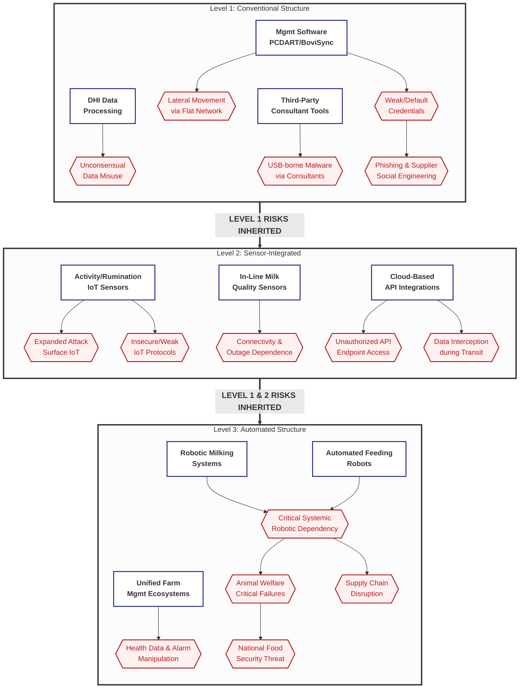

```mermaid
graph TD
    %% --- GLOBAL STYLING ---
    classDef tech fill:#ffffff,stroke:#1a237e,stroke-width:2px,font-weight:bold;
    classDef threat fill:#fff1f1,stroke:#b71c1c,stroke-width:2px,color:#b71c1c;

    %% --- LEVEL 1: CONVENTIONAL ---
    subgraph L1 ["Level&nbsp;1:&nbsp;Conventional&nbsp;Structure"]
        direction TB
        T1_A[Mgmt Software<br/>PCDART/BoviSync]:::tech
        T1_B[DHI Data<br/>Processing]:::tech
        T1_C[Third-Party<br/>Consultant Tools]:::tech
        
        V1_A{{Phishing & Supplier<br/>Social Engineering}}:::threat
        V1_B{{Weak/Default<br/>Credentials}}:::threat
        V1_C{{Lateral Movement<br/>via Flat Network}}:::threat
        V1_D{{USB-borne Malware<br/>via Consultants}}:::threat
        V1_E{{Unconsensual<br/>Data Misuse}}:::threat

        T1_A --> V1_B
        T1_A --> V1_C
        T1_B --> V1_E
        T1_C --> V1_D
        V1_B --> V1_A
    end

    %% --- LARGE BOLD INHERITANCE 1 ---
    L1 ==>|<b><font size='4'>LEVEL 1 RISKS INHERITED</font></b>| L2

    %% --- LEVEL 2: SENSOR-INTEGRATED ---
    subgraph L2 ["Level&nbsp;2:&nbsp;Sensor-Integrated&nbsp"]
        direction TB
        T2_A[Activity/Rumination<br/>IoT Sensors]:::tech
        T2_B[In-Line Milk<br/>Quality Sensors]:::tech
        T2_C[Cloud-Based<br/>API Integrations]:::tech

        V2_A{{Expanded Attack<br/>Surface IoT}}:::threat
        V2_B{{Insecure/Weak<br/>IoT Protocols}}:::threat
        V2_C{{Unauthorized API<br/>Endpoint Access}}:::threat
        V2_D{{Data Interception<br/>during Transit}}:::threat
        V2_E{{Connectivity &<br/>Outage Dependence}}:::threat

        T2_A --> V2_A
        T2_A --> V2_B
        T2_B --> V2_E
        T2_C --> V2_C
        T2_C --> V2_D
    end

    %% --- LARGE BOLD INHERITANCE 2 ---
    L2 ==>|<b><font size='4'>LEVEL 1 & 2 RISKS INHERITED</font></b>| L3

    %% --- LEVEL 3: AUTOMATED ---
    subgraph L3 ["Level&nbsp;3:&nbsp;Automated&nbsp;Structure"]
        direction TB
        T3_A[Robotic Milking<br/>Systems]:::tech
        T3_B[Automated Feeding<br/>Robots]:::tech
        T3_C[Unified Farm<br/>Mgmt Ecosystems]:::tech

        V3_A{{Critical Systemic<br/>Robotic Dependency}}:::threat
        V3_B{{Animal Welfare<br/>Critical Failures}}:::threat
        V3_C{{Health Data & Alarm<br/>Manipulation}}:::threat
        V3_D{{National Food<br/>Security Threat}}:::threat
        V3_E{{Supply Chain<br/>Disruption}}:::threat

        T3_A --> V3_A
        T3_B --> V3_A
        T3_C --> V3_C
        V3_A --> V3_B
        V3_B --> V3_D
        V3_A --> V3_E
    end

    %% --- CONTAINER STYLING ---
    style L1 fill:#fcfcfc,stroke:#333,stroke-width:3px
    style L2 fill:#fcfcfc,stroke:#333,stroke-width:3px
    style L3 fill:#fcfcfc,stroke:#333,stroke-width:3px
```    