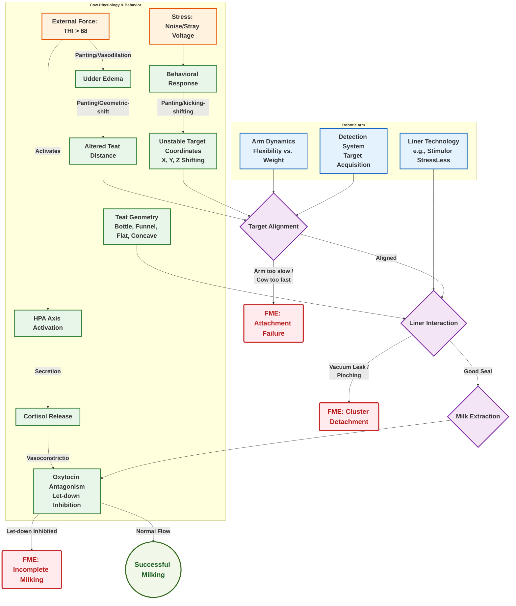

```mermaid
graph TD
    %% Nodes and Styles
    classDef env fill:#fff3e0,stroke:#e65100,stroke-width:3px,font-size:24px,font-weight:bold;
    classDef bio fill:#e8f5e9,stroke:#2e7d32,stroke-width:3px,font-size:24px,font-weight:bold;
    classDef mech fill:#e3f2fd,stroke:#1565c0,stroke-width:3px,font-size:24px,font-weight:bold;
    classDef event fill:#f3e5f5,stroke:#7b1fa2,stroke-width:3px,font-size:24px,font-weight:bold;
    classDef fail fill:#ffebee,stroke:#c62828,stroke-width:4px,font-size:26px,font-weight:bold,color:#b71c1c;
    classDef success fill:#f1f8e9,stroke:#33691e,stroke-width:4px,font-size:26px,font-weight:bold,color:#1b5e20;

    %% 1. EXTERNAL FORCING THI
    THI[External Force: THI > 68]:::env

    %% 2. BIOLOGICAL PATHWAYS
    subgraph Cow_Biology ["<span style='font-size:15px; font-weight:bold'>Cow Physiology & Behavior</span>"]
        direction TB
        %% Pathway A: Physiological
        THI -->|<span style='font-size:22px; font-weight:bold'>Activates</span>| HPA[HPA Axis Activation]:::bio
        HPA -->|<span style='font-size:22px; font-weight:bold'>Secretion</span>| Cortisol[Cortisol Release]:::bio
        Cortisol -->|<span style='font-size:22px; font-weight:bold'>Vasoconstrictio</span>| OxyBlock[Oxytocin Antagonism<br/>Let-down Inhibition]:::bio

        %% Pathway B: Behavioral/Physical
        THI -->|<span style='font-size:22px; font-weight:bold'>Panting/Vasodilation</span>| Edema[Udder Edema]:::bio
        Edema -->|<span style='font-size:22px; font-weight:bold'>Panting/Geometric-shift</span>| Dist[Altered Teat Distance]:::bio
        
        Stressors[Stress: Noise/Stray Voltage]:::env --> Behavior[Behavioral Response]:::bio
        Behavior -->|<span style='font-size:22px; font-weight:bold'>Panting/kicking-shifting</span>| Coords[Unstable Target Coordinates<br/>X, Y, Z Shifting]:::bio

        %% Pathway C: Static Anatomy
        Anatomy[Teat Geometry<br/>Bottle, Funnel, Flat, Concave]:::bio
    end

    %% 3. MECHANICAL PATHWAYS
    subgraph Robot_System ["<span style='font-size:15px; font-weight:bold'>Robotic arm"]
        direction TB
        Arm[Arm Dynamics<br/>Flexibility vs. Weight]:::mech
        Vision[Detection System<br/>Target Acquisition]:::mech
        Liner[Liner Technology<br/>e.g., Stimulor StressLess]:::mech
    end

    %% 4. THE INTERACTION The Event
    Dist --> TargetMismatch{Target Alignment}:::event
    Coords --> TargetMismatch
    Arm --> TargetMismatch
    Vision --> TargetMismatch

    Anatomy --> LinerFit{Liner Interaction}:::event
    Liner --> LinerFit

    %% 5. OUTCOMES
    TargetMismatch -- "<span style='font-size:22px; font-weight:bold'>Arm too slow /<br/> Cow too fast</span>" --> MechFail(FME: Attachment Failure):::fail
    TargetMismatch -- "<span style='font-size:22px; font-weight:bold'>Aligned</span>" --> LinerFit
    
    LinerFit -- "<span style='font-size:22px; font-weight:bold'>Vacuum Leak /<br/> Pinching</span>" --> CupSlip(FME: Cluster Detachment):::fail
    LinerFit -- "<span style='font-size:22px; font-weight:bold'>Good Seal</span>" --> Extraction{Milk Extraction}:::event

    Extraction --> OxyBlock
    OxyBlock -- "<span style='font-size:22px; font-weight:bold'>Let-down Inhibited</span>" --> PhysFail(FME: Incomplete Milking):::fail
    OxyBlock -- "<span style='font-size:22px; font-weight:bold'>Normal Flow</span>" --> Success((Successful Milking)):::success
```