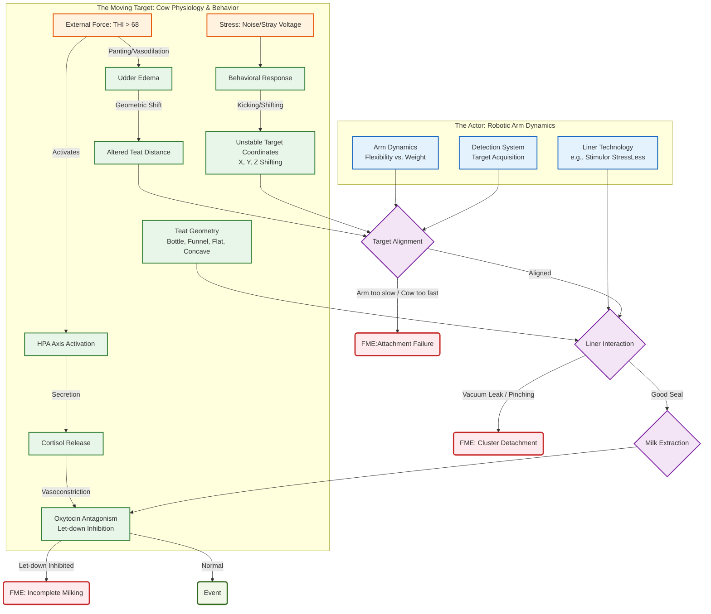

```mermaid
graph TD
    %% Nodes and Styles
    classDef env fill:#fff3e0,stroke:#e65100,stroke-width:2px;
    classDef bio fill:#e8f5e9,stroke:#2e7d32,stroke-width:2px;
    classDef mech fill:#e3f2fd,stroke:#1565c0,stroke-width:2px;
    classDef event fill:#f3e5f5,stroke:#7b1fa2,stroke-width:2px;
    classDef fail fill:#ffebee,stroke:#c62828,stroke-width:3px;
    classDef success fill:#f1f8e9,stroke:#33691e,stroke-width:3px;

    %% 1. EXTERNAL FORCING THI
    THI[External Force: THI > 68]:::env

    %% 2. BIOLOGICAL PATHWAYS
    subgraph Cow_Biology [The Moving Target: Cow Physiology & Behavior]
        direction TB
        %% Pathway A: Physiological
        THI -->|Activates| HPA[HPA Axis Activation]:::bio
        HPA -->|Secretion| Cortisol[Cortisol Release]:::bio
        Cortisol -->|Vasoconstriction| OxyBlock[Oxytocin Antagonism<br/>Let-down Inhibition]:::bio

        %% Pathway B: Behavioral/Physical
        THI -->|Panting/Vasodilation| Edema[Udder Edema]:::bio
        Edema -->|Geometric Shift| Dist[Altered Teat Distance]:::bio
        
        Stressors[Stress: Noise/Stray Voltage]:::env --> Behavior[Behavioral Response]:::bio
        Behavior -->|Kicking/Shifting| Coords[Unstable Target Coordinates<br/>X, Y, Z Shifting]:::bio

        %% Pathway C: Static Anatomy
        Anatomy[Teat Geometry<br/>Bottle, Funnel, Flat, Concave]:::bio
    end

    %% 3. MECHANICAL PATHWAYS
    subgraph Robot_System [The Actor: Robotic Arm Dynamics]
        direction TB
        Arm[Arm Dynamics<br/>Flexibility vs. Weight]:::mech
        Vision[Detection System<br/>Target Acquisition]:::mech
        Liner[Liner Technology<br/>e.g., Stimulor StressLess]:::mech
    end

    %% 4. THE INTERACTION The Event
    Dist --> TargetMismatch{Target Alignment}:::event
    Coords --> TargetMismatch
    Arm --> TargetMismatch
    Vision --> TargetMismatch

    Anatomy --> LinerFit{Liner Interaction}:::event
    Liner --> LinerFit

    %% 5. OUTCOMES
    TargetMismatch -- "Arm too slow / Cow too fast" --> MechFail(FME:Attachment Failure):::fail
    TargetMismatch -- "Aligned" --> LinerFit
    
    LinerFit -- "Vacuum Leak / Pinching" --> CupSlip(FME: Cluster Detachment):::fail
    LinerFit -- "Good Seal" --> Extraction{Milk Extraction}:::event

    Extraction --> OxyBlock
    OxyBlock -- "Let-down Inhibited" --> PhysFail(FME: Incomplete Milking):::fail
    OxyBlock -- "Normal" --> SuccessSuccessful(Event):::success
```