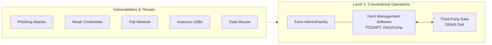

```mermaid
graph LR
    subgraph Operations ["Level 1: Conventional Operations"]
        direction LR
        A[Farm Admin/Family] --- B[Farm Management Software<br/>PCDART, DairyComp]
        B <--> C[Third-Party Data<br/>DRMS DHI]
    end

    subgraph Threats ["Vulnerabilities & Threats"]
        direction TD
        T1[Phishing Attacks]
        T2[Weak Credentials]
        T3[Flat Network]
        T4[Insecure USBs]
        T5[Data Misuse]
    end

    Threats -.-> Operations
```