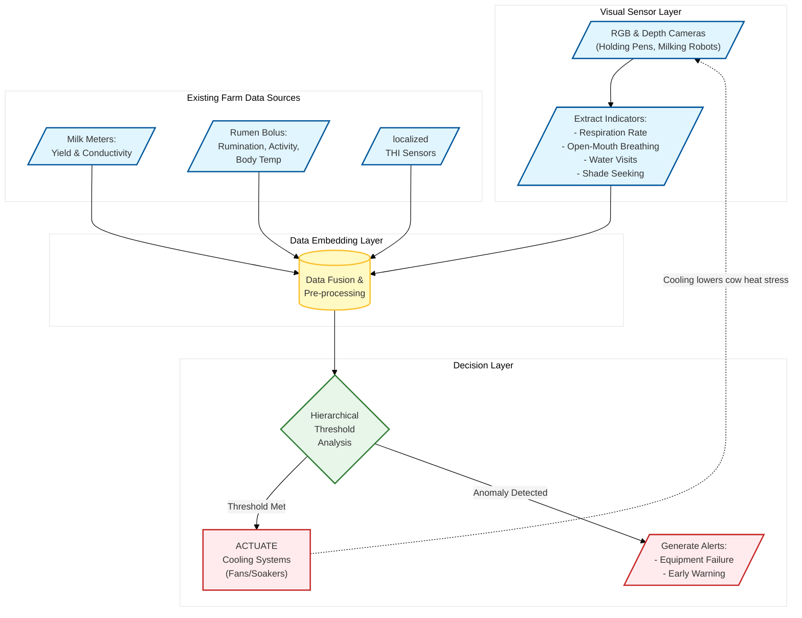

```mermaid

flowchart TD
    %% CONFIGURATION
    %%{init: {'theme': 'base', 'themeVariables': { 'fontSize': '14px', 'fontFamily': 'arial', 'primaryColor': '#fff', 'edgeLabelBackground':'#f4f4f4'}}}%%

    %% --- VISUAL SENSOR LAYER ---
    subgraph VisualLayer [Visual Sensor Layer]
        direction TB
        Cameras[/"RGB & Depth Cameras<br/>(Holding Pens, Milking Robots)"/]
        Indicators[/"Extract Indicators:<br/>- Respiration Rate<br/>- Open-Mouth Breathing<br/>- Water Visits<br/>- Shade Seeking"/]
        
        Cameras --> Indicators
    end

    %% --- EXTERNAL DATA SOURCES ---
    subgraph ExistingData [Existing Farm Data Sources]
        direction TB
        MilkSensors[/"Milk Meters:<br/>Yield & Conductivity"/]
        RumenSensors[/"Rumen Bolus:<br/>Rumination, Activity,<br/>Body Temp"/]
        EnvSensors[/" localized<br/>THI Sensors"/]
    end

    %% --- DATA EMBEDDING LAYER ---
    subgraph EmbeddingLayer [Data Embedding Layer]
        Fusion[("Data Fusion &<br/>Pre-processing")]
    end

    %% --- DECISION LAYER ---
    subgraph DecisionLayer [Decision Layer]
        Logic{"Hierarchical<br/>Threshold<br>Analysis"}
        Control["ACTUATE<br/>Cooling Systems<br/>(Fans/Soakers)"]
        Alerts[/"Generate Alerts:<br/>- Equipment Failure<br/>- Early Warning"/]
    end

    %% CONNECTIONS
    %% Inputs to Fusion
    Indicators --> Fusion
    MilkSensors --> Fusion
    RumenSensors --> Fusion
    EnvSensors --> Fusion

    %% Fusion to Logic
    Fusion --> Logic

    %% Logic Outputs
    Logic -- "Threshold Met" --> Control
    Logic -- "Anomaly Detected" --> Alerts
    
    %% Closed Loop Feedback
    Control -.-> |"Cooling lowers cow heat stress"| Cameras

    %% STYLING
    classDef sensors fill:#e1f5fe,stroke:#01579b,stroke-width:2px;
    classDef processing fill:#fff9c4,stroke:#fbc02d,stroke-width:2px;
    classDef decision fill:#e8f5e9,stroke:#2e7d32,stroke-width:2px;
    classDef action fill:#ffebee,stroke:#c62828,stroke-width:2px;

    class Cameras,MilkSensors,RumenSensors,EnvSensors,Indicators sensors;
    class Fusion processing;
    class Logic decision;
    class Control,Alerts action;
```