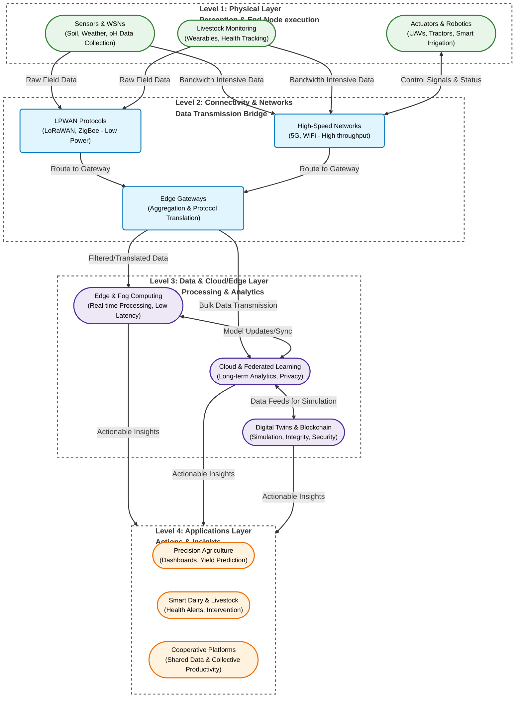

```mermaid

graph TD
    %% --- STYLING DEFINITIONS ---
    classDef physical fill:#e8f5e9,stroke:#2e7d32,stroke-width:2px,color:#000,rx:5px,ry:5px,font-size:14px;
    classDef conn fill:#e1f5fe,stroke:#0277bd,stroke-width:2px,color:#000,rx:5px,ry:5px,font-size:14px;
    classDef data fill:#ede7f6,stroke:#4527a0,stroke-width:2px,color:#000,rx:5px,ry:5px,font-size:14px;
    classDef app fill:#fff3e0,stroke:#ef6c00,stroke-width:2px,color:#000,rx:5px,ry:5px,font-size:14px;
    classDef containerLayer fill:none,stroke:#555,stroke-width:2px,stroke-dasharray: 5 5,font-size:16px,font-weight:bold;


    %% --- DIAGRAM STRUCTURE ---
    subgraph L4 [Level 4: Applications Layer<br/>Actions & Insights]
        direction LR
        A1(["Precision Agriculture<br/>(Dashboards, Yield Prediction)"]):::app
        A2(["Smart Dairy & Livestock<br/>(Health Alerts, Intervention)"]):::app
        A3(["Cooperative Platforms<br/>(Shared Data & Collective Productivity)"]):::app
    end

    subgraph L3 [Level 3: Data & Cloud/Edge Layer<br/>Storage, Processing & Analytics]
        direction LR
        D1(["Edge & Fog Computing<br/>(Real-time Processing, Low Latency)"]):::data
        D2(["Cloud & Federated Learning<br/>(Long-term Analytics, Privacy)"]):::data
        D3(["Digital Twins & Blockchain<br/>(Simulation, Integrity, Security)"]):::data
    end

    subgraph L2 [Level 2: Connectivity & Networks<br/>Data Transmission Bridge]
        direction LR
        C1["LPWAN Protocols<br/>(LoRaWAN, ZigBee - Low Power)"]:::conn
        C2["High-Speed Networks<br/>(5G, WiFi - High throughput)"]:::conn
        C3["Edge Gateways<br/>(Aggregation & Protocol Translation)"]:::conn
    end

    subgraph L1 [Level 1: Physical Layer<br/>Perception & End-Node execution]
        direction LR
        P1(["Sensors & WSNs<br/>(Soil, Weather, pH Data Collection)"]):::physical
        P2(["Actuators & Robotics<br/>(UAVs, Tractors, Smart Irrigation)"]):::physical
        P3(["Livestock Monitoring<br/>(Wearables, Health Tracking)"]):::physical
    end

    %% --- CONNECTIONS ---
    %% Physical to Connectivity
    P1 & P3 -->|Raw Field Data| C1
    P1 & P3 -->|Bandwidth Intensive Data| C2
    P2 <-->|Control Signals & Status| C2

    %% Connectivity Internal & Upwards
    C1 & C2 -->|Route to Gateway| C3
    C3 ==>|Filtered/Translated Data| D1
    C3 ==>|Bulk Data Transmission| D2

    %% Data Layer Interactions & Upwards
    D1 <-->|Model Updates/Sync| D2
    D2 <-->|Data Feeds for Simulation| D3
    D1 & D2 & D3 ===>|Actionable Insights| L4

    %% --- LAYER STYLING ---
    class L1,L2,L3,L4 containerLayer;
    linkStyle default stroke-width:2px,fill:none;
```