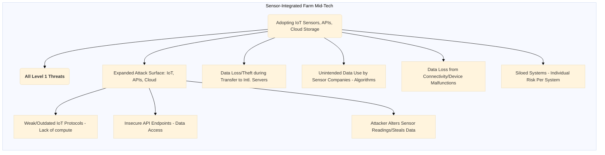

```mermaid
%%{init: {'theme': 'base', 'themeVariables': { 'fontSize': '14px' }}}%%
graph TD
subgraph Level2[Sensor-Integrated Farm Mid-Tech]
        direction TB
        L2_Intro(Adopting IoT Sensors, APIs, Cloud Storage)
        L2_Inherit1(<b>All Level 1 Threats</b>)
        L2_ThreatA[Expanded Attack Surface: IoT, APIs, Cloud]
        L2_ThreatB[Weak/Outdated IoT Protocols - Lack of compute]
        L2_ThreatC[Insecure API Endpoints - Data Access]
        L2_ThreatD[Data Loss/Theft during Transfer to Intl. Servers]
        L2_ThreatE[Unintended Data Use by Sensor Companies - Algorithms]
        L2_ThreatF[Data Loss from Connectivity/Device Malfunctions]
        L2_ThreatG[Siloed Systems - Individual Risk Per System]
        L2_ThreatH[Attacker Alters Sensor Readings/Steals Data]

        L2_Intro --> L2_Inherit1
        L2_Intro --> L2_ThreatA
        L2_ThreatA --> L2_ThreatB
        L2_ThreatA --> L2_ThreatC
        L2_ThreatA --> L2_ThreatH
        L2_Intro --> L2_ThreatD
        L2_Intro --> L2_ThreatE
        L2_Intro --> L2_ThreatF
        L2_Intro --> L2_ThreatG
    end
```