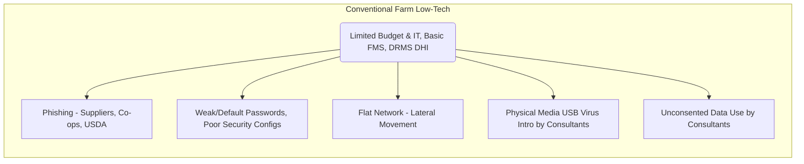

```mermaid
graph TD
    subgraph Level1[Conventional Farm Low-Tech]
        direction TB
        L1_Intro(Limited Budget & IT, Basic FMS, DRMS DHI)
        L1_ThreatA[Phishing - Suppliers, Co-ops, USDA]
        L1_ThreatB[Weak/Default Passwords, Poor Security Configs]
        L1_ThreatC[Flat Network - Lateral Movement]
        L1_ThreatD[Physical Media USB Virus Intro by Consultants]
        L1_ThreatE[Unconsented Data Use by Consultants]

        L1_Intro --> L1_ThreatA
        L1_Intro --> L1_ThreatB
        L1_Intro --> L1_ThreatC
        L1_Intro --> L1_ThreatD
        L1_Intro --> L1_ThreatE
    end
```    